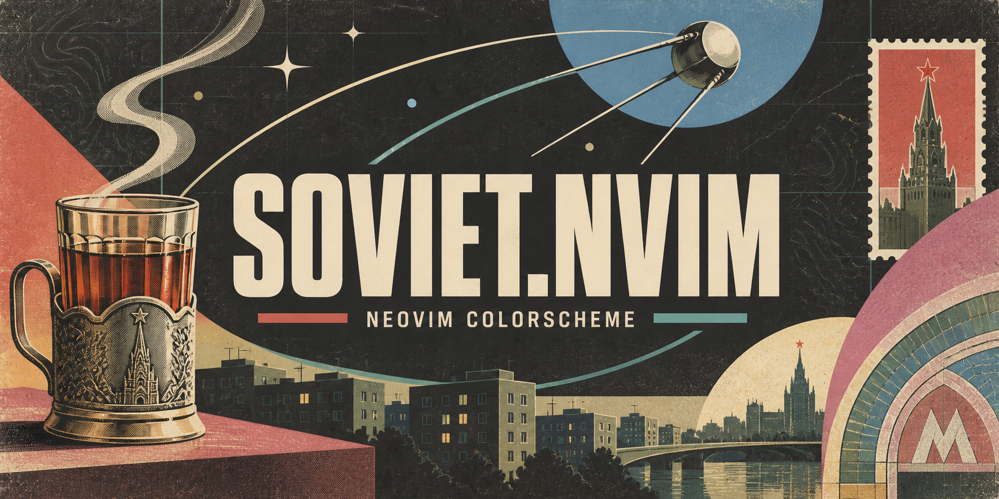

# ★ soviet.nvim



Light and dark Neovim colorschemes inspired by Soviet visual culture: book covers, editorial posters, enamel signs, technical diagrams, metro mosaics, and cartographic graphics.

Warm graphite and newspaper paper form the foundation. Printing red is reserved for primary accents, while burgundy, brass, ochre, enamel blue, and turquoise organize syntax and interface states. Olive, khaki, and steel form a quiet cartographic layer behind the code. This is an interpretation for the screen, not a reconstruction of historical printing inks.

- **soviet-dark** — layered warm graphite with clear, restrained contrast.
- **soviet-light** — aged newspaper paper with darker printing inks.

## Screenshots

### Dark


### Light


## Requirements

Neovim **0.10+** and a terminal with true color support. No plugin dependencies. The colorscheme enables `termguicolors` and sets `background` for its variant.

## Installation

### vim.pack

Requires Neovim **0.12+** for the built-in [vim.pack](https://neovim.io/doc/user/pack/#vim.pack) plugin manager. Add this to your `init.lua`:

```lua
vim.pack.add({
  { src = "https://github.com/rezniqov/soviet.nvim" },
})

require("soviet").setup({}) -- Optional; add your settings here.
vim.cmd.colorscheme("soviet-dark")
-- vim.cmd.colorscheme("soviet-light")
```

Restart Neovim and confirm installation if prompted.

### lazy.nvim

Add this plugin spec to your existing [lazy.nvim](https://lazy.folke.io/spec) setup:

```lua
{
  "rezniqov/soviet.nvim",
  lazy = false,
  priority = 1000,
  opts = {}, -- Add your soviet.nvim settings here.
  config = function(_, opts)
    require("soviet").setup(opts)
    vim.cmd.colorscheme("soviet-dark")
    -- vim.cmd.colorscheme("soviet-light")
  end,
}
```

Restart Neovim to install the plugin. Choose your default variant in the `config` function. If you organize specs into imported files, wrap the spec above in `return { ... }`.

### LazyVim

Soviet automatically detects plugins registered with lazy.nvim. Add this to `lua/plugins/colorscheme.lua`:

```lua
return {
  {
    "rezniqov/soviet.nvim",
    lazy = false,
    priority = 1000,
    opts = {},
  },
  {
    "LazyVim/LazyVim",
    opts = {
      colorscheme = "soviet-dark",
      -- colorscheme = "soviet-light",
    },
  },
}
```

When loaded by LazyVim, Soviet reads lazy.nvim's plugin registry and generates highlight groups only for installed integrations. No additional LazyVim-specific configuration is required.

## Usage

Choose a variant after installing the plugin:

```vim
:colorscheme soviet-dark
:colorscheme soviet-light
```

With `vim.pack`, keep your choice in `init.lua` after the installation block:

```lua
vim.cmd.colorscheme("soviet-dark")
-- vim.cmd.colorscheme("soviet-light")
```

The variant is selected by its colorscheme name. There is no OS synchronization or `style` option. Configuration is optional.

## Configuration

With `vim.pack`, call `setup()` before applying the colorscheme. With lazy.nvim, put the same settings in the `opts` table of the `rezniqov/soviet.nvim` spec; the `config` function above passes them to `setup()`. All defaults are shown below:

```lua
require("soviet").setup({
  transparent = false,
  terminal_colors = true,
  styles = {
    comments = { italic = true },
    keywords = {},
    functions = {},
    strings = {},
    variables = {},
    sidebars = "dark", -- "dark", "normal", or "transparent"
    floats = "dark", -- "dark", "normal", or "transparent"
  },
  dim_inactive = false,
  lualine_bold = true,
  cache = true,
  plugins = {
    all = package.loaded.lazy == nil,
    auto = true,
  },
  integrations = {}, -- Legacy aliases; prefer plugins.
  palette = {},
  -- on_colors = function(colors) end,
  -- on_highlights = function(highlights, colors) end,
})
vim.cmd.colorscheme("soviet-dark")
```

Each `setup()` call merges your options with fresh defaults. It saves the configuration; reapply the chosen colorscheme to update highlights.

`transparent` removes the main editor background. Sidebar and floating-window backgrounds are controlled independently by `styles.sidebars` and `styles.floats`. Setting `terminal_colors = false` leaves existing ANSI palette settings untouched.

With lazy.nvim, `plugins.auto = true` enables integrations found in its registry. Outside lazy.nvim, `plugins.all` defaults to `true`, so plugin highlight groups are defined eagerly. You can override either behavior by group name or lazy.nvim plugin name:

```lua
plugins = {
  all = false,
  auto = true,
  snacks = true,
  ["render-markdown.nvim"] = false,
  telescope = { enabled = true },
}
```

The old `integrations` table is still accepted for backwards compatibility; new configurations should use `plugins`.

### Custom colors and highlights

```lua
require("soviet").setup({
  styles = { comments = { italic = false } },
  palette = { property = "#C8C1AA" },
  on_colors = function(c)
    c.border_highlight = c.brass
  end,
  on_highlights = function(hl, c)
    hl.CursorLineNr = { fg = c.brass, bold = false }
    hl["@keyword.return"] = { fg = c.burgundy, bold = true }
    hl.TelescopeBorder = { fg = c.brass, bg = c.bg_light }
  end,
})
vim.cmd.colorscheme("soviet-dark")
```

The `on_highlights` callback runs after all highlight definitions are assembled and before they are applied. Replace a linked group's entire table when changing its colors: a `link` takes precedence over other attributes.

Palette overrides apply to both variants. `on_colors` runs after derived colors are created; `on_highlights` then receives the complete color table. Using its colors keeps highlights consistent with the active variant.

Retrieve a fresh palette, including your overrides, with:

```lua
local colors = require("soviet").get_palette()
local dark = require("soviet").get_palette("dark")
local light = require("soviet").get_palette("light")
```

Without an argument, this returns the active variant, or dark before either colorscheme has loaded. Modifying the returned table does not change the theme.

## 🎨 Palette

| Role                                            | Dark      | Light     |
| ----------------------------------------------- | --------- | --------- |
| Editor background                               | `#292727` | `#DDD0B8` |
| Sidebar / statusline                            | `#1F1D1D` | `#C9B99F` |
| Elevated surface                                | `#353232` | `#EBDFC9` |
| Cursor line                                     | `#403A3A` | `#C3B197` |
| Selection                                       | `#554B54` | `#C8AEB2` |
| Border                                          | `#746666` | `#8E7C69` |
| Text                                            | `#D8CFC4` | `#382F2B` |
| Bright text                                     | `#E9DFD0` | `#292626` |
| Comments                                        | `#A3A187` | `#5B5A47` |
| Keywords / booleans — burgundy                  | `#C58F9D` | `#87455A` |
| Functions / search — brass                      | `#D1B078` | `#74541C` |
| Strings / characters — green ink                | `#65AA88` | `#2B674D` |
| Cartographic contours — khaki                   | `#B1A178` | `#675834` |
| Numbers / warnings — ochre                      | `#D29A69` | `#864A20` |
| Types / classes / information — enamel blue     | `#5B93BC` | `#36739C` |
| Preprocessor / map labels — steel               | `#7899A0` | `#405B62` |
| Operators / secondary text                      | `#B7AAA3` | `#615751` |
| Properties                                      | `#C6B8AA` | `#685448` |
| Builtins — industrial turquoise                 | `#45A39E` | `#176466` |
| Hints / cartographic grid — olive               | `#A8AC7D` | `#585C3B` |
| Added lines / ANSI green                        | `#B8BA73` | `#4B602D` |
| ANSI bright green                               | `#CED08B` | `#426020` |
| Primary headings / Normal mode — printing red   | `#E36A5B` | `#9C382E` |
| Errors                                          | `#EF7565` | `#A62D24` |
| Removed lines / substitutions — dark red        | `#A14C45` | `#843C35` |
| Brown                                           | `#B28A75` | `#74523F` |

Comments and structural elements are deliberately subdued. Adjust `palette.comment`, `palette.muted`, `palette.olive`, or `palette.border` to suit your display.

## Integrations

Built-in coverage includes Vim syntax, Tree-sitter, LSP semantic tokens, diagnostics, inlay hints, diff views, spell checking, and terminal ANSI colors.

Plugin coverage includes Aerial, ALE, Alpha, Barbar, Blink, Bufferline, Codeium, Copilot, Dashboard, DAP, Flash, fzf-lua, GitGutter, Gitsigns, GrugFar, Headlines, Hop, Illuminate, indent-blankline, Lazy, Leap, Lspsaga, the Mini modules, Navic, neo-tree, Neogit, Neotest, Noice, nvim-cmp, nvim-notify, nvim-scrollbar, nvim-tree, Octo, Rainbow Delimiters, render-markdown, Sidekick, Snacks, Supermaven, Telescope, Treesitter Context, Trouble, Vimwiki, WhichKey, Yanky, and related integrations. Oil support is retained as well.

Core Vim syntax, Tree-sitter, LSP semantic tokens, diagnostics, inlay hints, diff views, and completion-kind groups are always available. Integrations define highlights only; they never load the corresponding plugins.

Plugin UI uses brass and ochre as its working accents, with burgundy and turquoise for secondary states. Printing red appears only at primary focal points and critical states. Enamel blue is reserved for types, file paths, information, and Insert mode so it does not dominate LazyVim's interface.

Bold keywords and types create a compact typographic hierarchy while functions, variables, and body text keep their normal weight. Headings progress through red, burgundy, brass, enamel blue, olive, and muted ink. Dashboard integrations follow the same structure with red headers, brass shortcuts, enamel-blue icons, and olive descriptions.

A subdued cartographic layer uses olive grids, khaki contours, and steel labels for line numbers, folds, indent guides, inlay hints, Aerial, MiniMap, Neotest, and Snacks. It stays visually behind syntax and primary interface accents.

LSP semantic tokens use the same roles as Tree-sitter. The final result depends on the parser's captures and the language server's tokens.

### Lualine

Apply the colorscheme before configuring lualine:

```lua
require("lualine").setup({ options = { theme = "soviet" } })
```

The lualine theme `soviet` follows the active variant. Fixed `soviet-dark` and `soviet-light` themes are also available. Lualine's default `theme = "auto"` discovers them by colorscheme name. Normal uses printing red, Insert enamel blue, Visual burgundy, Replace signal red, Command brass, and Terminal turquoise.

The plugin clears its lualine theme cache when loading a colorscheme, allowing lualine's `ColorScheme` handler to pick up the new palette.

### Terminal colors and LazyGit

The ANSI palette applies to newly created terminal buffers. An existing terminal or LazyGit session may retain its previous colors after switching variants. Close that terminal buffer and create a new one to refresh its palette. Changing the colorscheme does not restart terminal processes.

## 📚 Structure

In-editor documentation is available through `:help soviet`, `:help soviet-setup`, `:help soviet-palette`, and `:help soviet-lualine`.

```text
colors/soviet-dark.lua          Dark colorscheme entry point
colors/soviet-light.lua         Light colorscheme entry point
lua/soviet/init.lua             Public API and highlight application
lua/soviet/config.lua           Defaults and configuration
lua/soviet/palette.lua          Both palettes
lua/soviet/colors.lua           Derived semantic colors
lua/soviet/groups/              Core and plugin highlight groups
lua/soviet/util.lua             Color blending and highlight cache
lua/soviet/lualine.lua          Lualine palette builder
lua/lualine/themes/soviet.lua   Lualine theme for the active variant
lua/lualine/themes/soviet-*.lua  Fixed lualine variants
doc/soviet.txt                  :help soviet
```

The plugin has no timers, autocommands, or OS preference readers. It updates highlight groups, `colors_name`, color options, and optionally `terminal_color_0` through `terminal_color_15`. The generated highlight table is cached by variant by default; set `cache = false` to disable this.

## License

Licensed under the [Apache License, Version 2.0](LICENSE).
